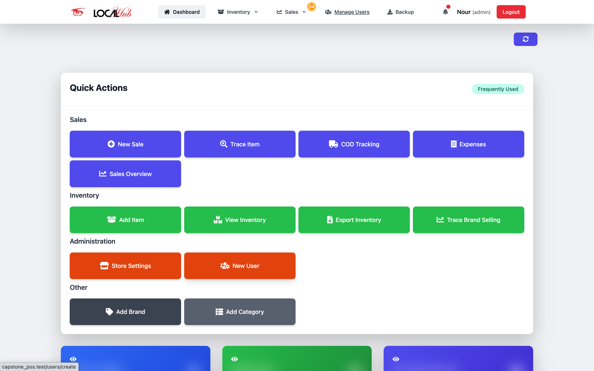
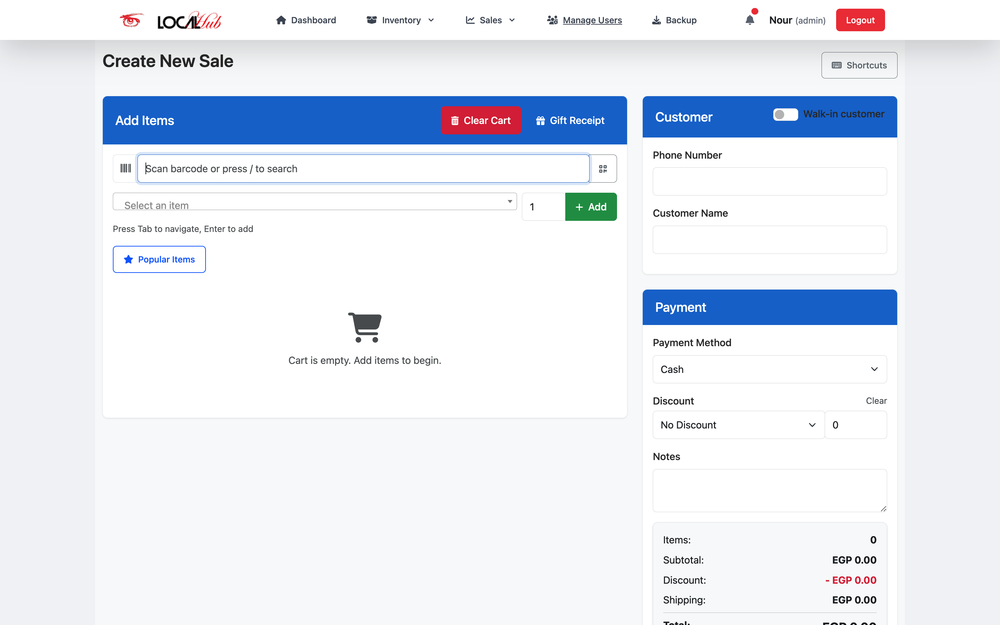
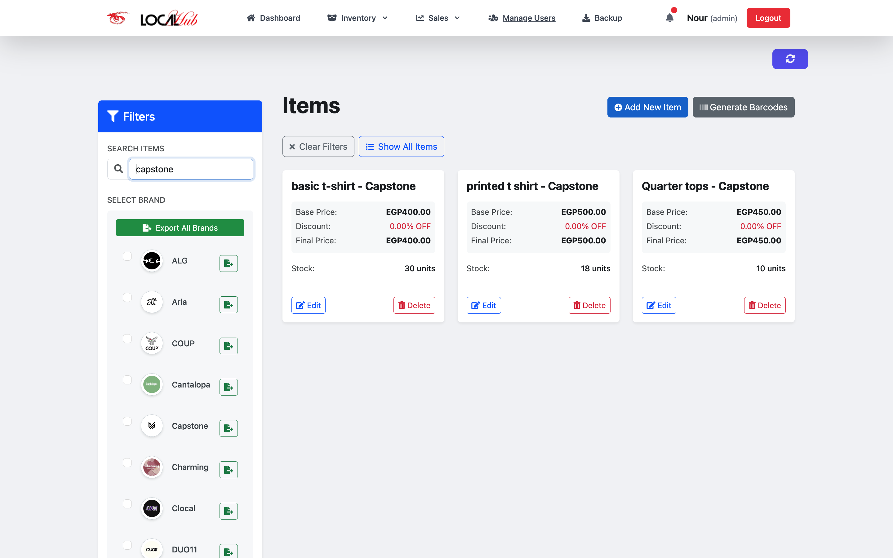
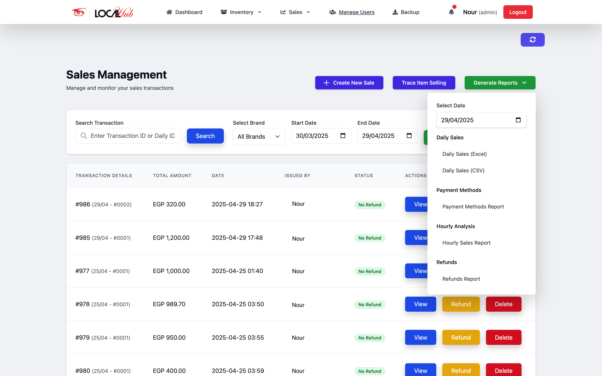
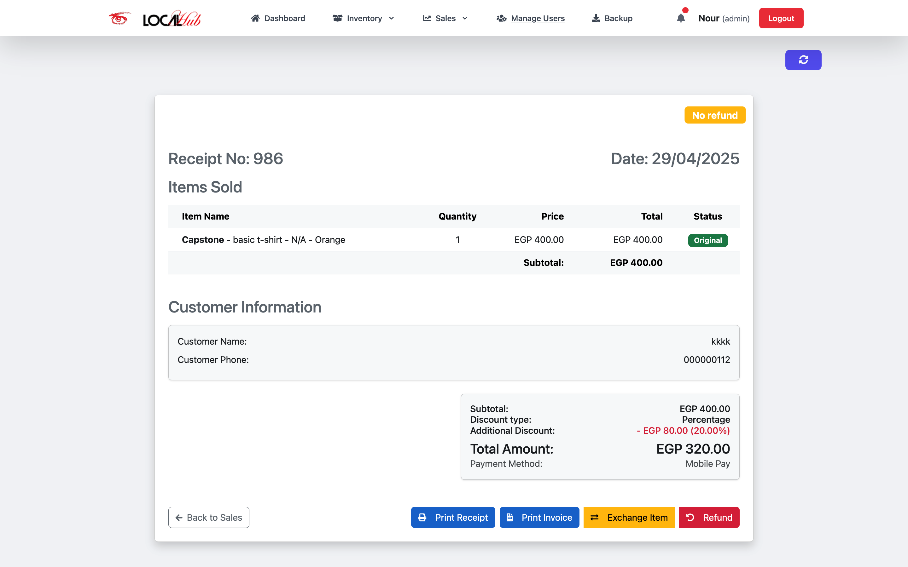

# LocalHub POS - Point of Sale System

<p align="center">
  
  
</p>

<p align="center">
  A comprehensive Point of Sale (POS) system built with Laravel, designed for modern retail businesses.
</p>

## 📋 Overview

LocalHub POS is an advanced Point of Sale solution built on Laravel 11 that combines robust inventory management, streamlined sales processing, and detailed reporting features. The system is designed to be used either as a web application or as a standalone desktop application through an Electron wrapper.

## 📸 Screenshots

> **Note:** All data shown in screenshots are fictitious demo data. No real customer information, transactions, or business data are displayed in any of the images.

<p align="center">
  
  <p align="center"><em>Dashboard - Main administrative interface</em></p>
</p>

<div style="display: flex; justify-content: space-between; margin-bottom: 20px;">
  <div style="flex: 1; margin-right: 10px;">
    
    <p align="center"><em>POS Interface - Streamlined checkout process</em></p>
  </div>
  <div style="flex: 1; margin-left: 10px;">
    
    <p align="center"><em>Inventory Management - Stock tracking and control</em></p>
  </div>
</div>

<div style="display: flex; justify-content: space-between;">
  <div style="flex: 1; margin-right: 10px;">
    
    <p align="center"><em>Sales Reports - Detailed analytics and insights</em></p>
  </div>
  <div style="flex: 1; margin-left: 10px;">
    
    <p align="center"><em>Sale Preview - Professional customer receipts, Refunds and Exchanges</em></p>
  </div>
</div>

## 🌟 Key Features

### 💼 Sales Management
- **Multi-payment processing**: Support for Cash, Credit Card, Mobile Pay, and COD
- **Intuitive Sales UI**: Fast checkout process with product search and scanning
- **Discount System**: Apply percentage or fixed discounts to entire sales or individual items
- **Returns & Exchanges**: Process returns and exchanges with full tracking
- **Gift Items**: Add complementary items to any purchase

### 📦 Inventory Management
- **Complete CRUD Operations**: For Products, Categories, and Brands
- **Stock Control**: Real-time inventory tracking with low stock alerts
- **Product Variants**: Support for products with multiple variants (size, color)
- **Parent-Child Relationships**: Group related products under a parent item
- **Bulk Import/Export**: Import/export inventory data via Excel/CSV

### 🏷️ Barcode System
- **Automatic Generation**: Generate barcodes for all inventory items
- **Custom Label Printing**: Print barcode labels in various formats
- **Scanning Support**: Scan barcodes using device camera or barcode scanner
- **Label Customization**: Customize barcode label appearance

### 🧾 Receipts & Invoices
- **Thermal Printing**: Direct integration with thermal receipt printers
- **PDF Generation**: Generate professional PDF invoices
- **Customizable Templates**: Customize receipt/invoice layout and content
- **Digital Receipts**: Option to email receipts to customers

### 📊 Reporting & Analytics
- **Sales Reports**: Daily, weekly, monthly, and custom date range reports
- **Inventory Reports**: Stock levels, inventory valuation, and movement history
- **Payment Method Reports**: Track sales by payment method
- **Brand Performance**: Analyze sales performance by brand
- **Excel/CSV Export**: Export all reports in various formats

### 💵 Cash Management
- **Cash Tracking**: Monitor cash drawer contents
- **End-of-day Reconciliation**: Verify cash against sales records
- **Expense Recording**: Log and categorize business expenses
- **Cash Flow Reports**: Track all cash movements

### ⚙️ Store Settings
- **Customizable Branding**: Configure store name, logo, and contact information
- **Receipt Customization**: Customize receipt footer messages and policies
- **User Management**: Create and manage user accounts with different access levels
- **System Preferences**: Configure system behavior and defaults

## 💻 Technical Features

### 🖥️ Desktop Application
- **Cross-platform Desktop App**: Run as a standalone application on Windows and macOS
- **Offline Capability**: Core functionality works without internet connection
- **Native Printer Integration**: Direct integration with receipt printers

### 🔒 Security
- **Role-based Access Control**: Different permission levels for Admins, Managers, and Cashiers
- **Audit Trail**: Track all important system actions
- **Secure Authentication**: Modern authentication flow with Laravel Breeze

### 🔧 Integration & Backup
- **Automated Backups**: Scheduled database backups with Spatie Laravel Backup
- **Export/Import System**: Export and import system data for migration
- **API Endpoints**: RESTful API for potential integrations

## 🎯 Project Purpose

LocalHub POS was developed to provide small to medium-sized retail businesses with an affordable yet powerful point of sale solution. It addresses common pain points in retail operations:

- Complex inventory management with parent-child product relationships
- Need for detailed sales analytics and reporting
- Efficient barcode generation and scanning 
- Professional receipt generation and printing
- Cash management and reconciliation
- Multi-user access with role-based permissions

Whether you run a clothing store with multiple variants, a grocery store with inventory tracking needs, or any retail business requiring sales and inventory management, LocalHub POS provides the tools you need.

## 💻 Technologies Used

This project leverages a modern tech stack:

### Backend
- **Laravel 11.x** - PHP framework providing the core architecture
- **MySQL** - Database system for data storage
- **Spatie Permissions** - Role and permission management
- **Spatie Backup** - Automated database backups
- **Laravel Breeze** - Authentication scaffolding

### Frontend
- **TailwindCSS** - Utility-first CSS framework
- **AlpineJS** - Lightweight JavaScript framework
- **Filament** - Admin panel and CRUD interface
- **Blade** - Laravel's templating engine

### Third-party Integrations
- **Picqer Barcode Generator** - For barcode generation
- **Mike42/escpos-php** - For thermal receipt printing
- **Laravel Excel/CSV** - For importing/exporting data
- **Laravel DomPDF** - For PDF generation

### Desktop Application
- **Electron.js** - For wrapping the web app as a desktop application

## 🏗️ Project Structure

```
app/
├── Console/            # Console commands
├── Exports/            # Excel export definitions
├── Http/               # Controllers, Middleware, Requests
├── Models/             # Eloquent models
├── Providers/          # Service providers
└── Services/           # Business logic services

config/                 # Configuration files
database/
├── migrations/         # Database migrations
└── seeders/            # Database seeders

public/                 # Publicly accessible files
├── build/              # Compiled assets
└── images/             # Static images

resources/              # Frontend resources
└── views/              # Blade templates
```

## 🤝 Contributing

We welcome contributions to LocalHub POS! Here's how you can help:

1. Fork the repository
2. Create your feature branch (`git checkout -b feature/amazing-feature`)
3. Commit your changes (`git commit -m 'Add some amazing feature'`)
4. Push to the branch (`git push origin feature/amazing-feature`)
5. Open a Pull Request

Please make sure to update tests as appropriate.

## 🐛 Bug Reporting

Found a bug? Please report it by creating an issue in this repository. Be sure to include:

- Detailed description of the bug
- Steps to reproduce
- Expected behavior
- Screenshots (if applicable)
- System information

## 📝 Development Roadmap

Future plans for LocalHub POS include:

- [ ] Integration with payment gateways (Stripe, PayPal)
- [ ] Customer loyalty program
- [ ] Multi-language support
- [ ] Advanced inventory forecasting
- [ ] Mobile app version
- [ ] Cloud synchronization across multiple devices
- [ ] Enhanced reporting and analytics

## 📜 Changelog

### v1.0.0 (April 2025)
- Initial release with core POS functionality
- Inventory management
- Sales processing
- Reporting system
- Desktop application wrapper

## 📦 Installation

### Requirements
- PHP 8.2 or higher
- MySQL 5.7 or higher
- Composer
- Node.js and NPM

### Web Application Setup

```bash
# Clone the repository
git clone https://github.com/yourusername/localhub-pos.git
cd localhub-pos

# Install PHP dependencies
composer install

# Install JavaScript dependencies
npm install

# Create environment file and generate application key
cp .env.example .env
php artisan key:generate

# Configure database in .env file
# DB_CONNECTION=mysql
# DB_HOST=127.0.0.1
# DB_PORT=3306
# DB_DATABASE=localhub_pos
# DB_USERNAME=root
# DB_PASSWORD=

# Run migrations and seeders
php artisan migrate --seed

# Build frontend assets
npm run build

# Start the development server
php artisan serve
```

### Desktop Application Setup

```bash
# After setting up the web application
# Build the desktop application
npm run electron:build

# The built application will be available in the dist_electron directory
```

## 🖨️ Printer Setup

### Thermal Receipt Printer
1. Configure your printer name in the `printer_config.json` file
2. For Windows: Ensure printer drivers are installed
3. For macOS: CUPS printing system is utilized

### Barcode Label Printer
1. Ensure the printer is correctly installed on your system
2. Adjust label size and format in the application settings

## 👥 User Roles

- **Administrator**: Full access to all system features
- **Manager**: Access to inventory, sales, and basic reports
- **Cashier**: Access to sales processing and basic inventory lookup

Default admin login:
- Email: admin@example.com
- Password: password

## 🌐 Progressive Web App (PWA)

LocalHub POS can be installed as a PWA on supported devices, providing a native-like experience on mobile and desktop browsers with internet connection.

## 📱 Mobile Compatibility

The application is fully responsive and optimized for use on tablets and mobile devices, making it suitable for businesses with mobile point-of-sale needs.

## 🔄 Data Backup

Automated database backups are configured using Spatie Laravel Backup. By default, backups run daily and are stored in the `storage/app/backups` directory.

## 🔐 License

This project is licensed under the [MIT license](https://opensource.org/licenses/MIT).

## 📞 Support

For support and inquiries, please contact noureldinfarag@gmail.com or open an issue on GitHub.

---

Built with ❤️ using Laravel and modern web technologies.

