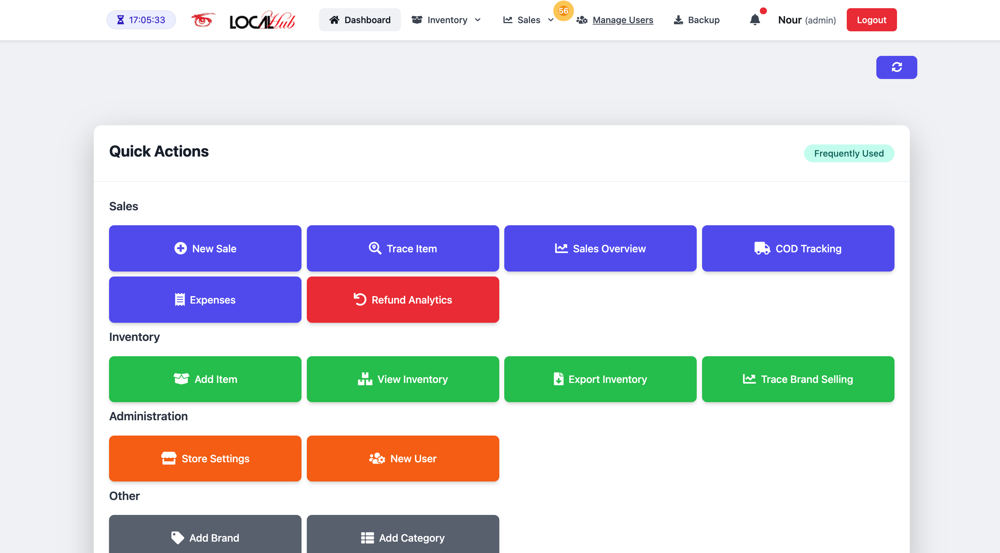

# LocalHub POS - Point of Sale System

<div align="center">
  
<br>
  
</div>

<p align="center">
  A comprehensive Point of Sale (POS) system built with Laravel, designed for modern retail businesses.
</p>

## 📋 Overview

LocalHub POS is an advanced Point of Sale solution built on Laravel that combines robust inventory management, streamlined sales processing, and detailed reporting features. The system is designed to be used either as a web application or as a standalone desktop application through an Electron wrapper.

## 📸 Screenshots

> **Note:** All data shown in screenshots are fictitious demo data. No real customer information, transactions, or business data are displayed in any of the images.

<p align="center">
  
  <p align="center"><em>Dashboard - Main administrative interface</em></p>
</p>

<div style="display: flex; justify-content: space-between; margin-bottom: 20px;">
  <div style="flex: 1; margin-right: 10px;">
    
    <p align="center"><em>POS Interface - Streamlined checkout process</em></p>
  </div>
  <div style="flex: 1; margin-left: 10px;">
    
    <p align="center"><em>Inventory Management - Stock tracking and control</em></p>
  </div>
</div>

<div style="display: flex; justify-content: space-between;">
  <div style="flex: 1; margin-right: 10px;">
    
    <p align="center"><em>Sales Reports - Detailed analytics and insights</em></p>
  </div>
  <div style="flex: 1; margin-left: 10px;">
    
    <p align="center"><em>Sale Preview - Professional customer receipts, Refunds and Exchanges</em></p>
  </div>
</div>

## 🌟 Key Features

### 💼 Sales Management
- **Multi-payment processing**: Support for Cash, Credit Card, Mobile Pay, and COD
- **Intuitive Sales UI**: Fast checkout process with product search and barcode scanning
- **Discount System**: Apply percentage or fixed discounts to entire sales or individual items
- **Returns & Exchanges**: Process returns and exchanges with full tracking
- **Gift Items**: Add complementary items to any purchase
- **Cash Drawer Control**: Automatic cash drawer opening during sales
- **Thermal Receipt Printing**: Direct integration with thermal receipt printers

### 📦 Inventory Management
- **Complete CRUD Operations**: For Products, Categories, and Brands
- **Stock Control**: Real-time inventory tracking with low stock alerts
- **Product Variants**: Support for products with multiple variants (size, color)
- **Parent-Child Relationships**: Group related products under a parent item
- **Bulk Import/Export**: Import/export inventory data via Excel/CSV

### 🏷️ Barcode System
- **Automatic Generation**: Generate barcodes for all inventory items
- **Custom Label Printing**: Print barcode labels in various formats
- **Scanning Support**: Scan barcodes for quick item lookup
- **Code-128 Format**: Industry standard barcode format

### 🧾 Receipts & Printing
- **Thermal Printing**: Direct integration with thermal receipt printers
- **Customizable Templates**: Receipt templates with conditional sections
- **Standard & Gift Receipts**: Different receipt types for different purposes
- **Multi-language Support**: Support for special characters including Arabic

### 👥 Customer Management
- **Customer Database**: Store and manage customer information
- **Purchase History**: Track customer purchases and spending
- **Quick Lookup**: Find customers by phone number or name
- **Shipping Information**: Save delivery addresses for future orders

### 📊 Reporting & Analytics
- **Sales Reports**: Daily, weekly, monthly, and custom date range reports
- **Inventory Reports**: Stock levels, inventory valuation, and movement history
- **Payment Method Reports**: Track sales by payment method
- **Brand Performance**: Analyze sales performance by brand
- **Excel/CSV Export**: Export all reports in various formats

### 💵 Cash Management
- **Cash Tracking**: Monitor cash drawer contents
- **Cash Drawer Control**: Open cash drawer from the system
- **Payment Recording**: Track all payment types

### ⚙️ Store Settings
- **Customizable Branding**: Configure store name, logo, and social media details
- **Receipt Customization**: Customize receipt content and footer messages
- **User Management**: Create and manage user accounts with different access levels
- **Thermal Printer Configuration**: Configure printer settings for different OS platforms

## 💻 Technical Features

### 🖥️ Cross-Platform Support
- **Windows & macOS Support**: Compatible with both operating systems
- **OS Detection**: Automatically adapts to the operating system for printer integration
- **Configuration Files**: External configuration for easier setup

### 🔒 Security
- **Role-based Access Control**: Different permission levels for Admins, Managers, and Cashiers
- **Input Validation**: Secure form processing and data validation
- **CSRF Protection**: Prevention of cross-site request forgery

### 🖨️ Printing Technology
- **ESC/POS Commands**: Industry standard for thermal receipt printers
- **CUPS on macOS**: Common UNIX Printing System integration for macOS
- **Windows Printing**: Native Windows printer support

### 🔧 Integration & Data Management
- **Import/Export System**: Export and import system data
- **Database Transactions**: Ensures data integrity during complex operations
- **PDF Generation**: For reports and printable documents

## 🎯 Project Purpose

LocalHub POS was developed to provide small to medium-sized retail businesses with an affordable yet powerful point of sale solution. It addresses common pain points in retail operations:

- Complex inventory management with parent-child product relationships
- Need for detailed sales analytics and reporting
- Efficient barcode generation and scanning 
- Professional receipt generation and printing
- Cash management and reconciliation
- Multi-user access with role-based permissions

Whether you run a clothing store with multiple variants, a grocery store with inventory tracking needs, or any retail business requiring sales and inventory management, LocalHub POS provides the tools you need.

## 💻 Technologies Used

This project leverages a modern tech stack:

### Backend
- **Laravel** - PHP framework providing the core architecture
- **MySQL** - Database system for data storage
- **Eloquent ORM** - For database interactions

### Frontend
- **Blade Templates** - Laravel's templating engine
- **JavaScript/jQuery** - For interactive UI elements
- **TailwindCSS** - For responsive design

### Printing & Barcodes
- **Mike42/escpos-php** - For thermal receipt printing
- **Picqer/php-barcode-generator** - For barcode generation
- **DomPDF** - For PDF generation

### File & Data Processing
- **Laravel Excel/CSV** - For importing/exporting data
- **File Storage** - For managing uploaded files and images

### Desktop Application
- **Electron.js** - For wrapping the web app as a desktop application

## 🏗️ Project Structure

```
app/
├── Console/            # Console commands
├── Exports/            # Excel export definitions
├── Http/               # Controllers, Middleware, Requests
├── Models/             # Eloquent models
├── Providers/          # Service providers
└── Services/           # Business logic services

config/                 # Configuration files
database/
├── migrations/         # Database migrations
└── seeders/            # Database seeders

public/                 # Publicly accessible files
├── build/              # Compiled assets
└── images/             # Static images

resources/              # Frontend resources
└── views/              # Blade templates
```

## 🤝 Contributing

We welcome contributions to LocalHub POS! Here's how you can help:

1. Fork the repository
2. Create your feature branch (`git checkout -b feature/amazing-feature`)
3. Commit your changes (`git commit -m 'Add some amazing feature'`)
4. Push to the branch (`git push origin feature/amazing-feature`)
5. Open a Pull Request

Please make sure to update tests as appropriate.

## 🐛 Bug Reporting

Found a bug? Please report it by creating an issue in this repository. Be sure to include:

- Detailed description of the bug
- Steps to reproduce
- Expected behavior
- Screenshots (if applicable)
- System information

## 📝 Development Roadmap

Future plans for LocalHub POS include:

- [ ] Integration with payment gateways (Stripe, PayPal)
- [ ] Customer loyalty program
- [ ] Multi-language support
- [ ] Advanced inventory forecasting
- [ ] Mobile app version
- [ ] Cloud synchronization across multiple devices
- [ ] Enhanced reporting and analytics

## 📜 Changelog

### v1.0.0 (April 2025)
- Initial release with core POS functionality
- Inventory management
- Sales processing
- Reporting system
- Desktop application wrapper

## 📦 Installation

### Requirements
- PHP 8.0 or higher
- MySQL 5.7 or higher
- Composer
- Node.js and NPM for frontend assets

### Setup

```bash
# Clone the repository
git clone https://github.com/yourusername/capstone_pos.git
cd capstone_pos

# Install PHP dependencies
composer install

# Install JavaScript dependencies
npm install

# Create environment file and generate application key
cp .env.example .env
php artisan key:generate

# Configure database in .env file
# DB_CONNECTION=mysql
# DB_HOST=127.0.0.1
# DB_PORT=3306
# DB_DATABASE=YOURDATABASENAME
# DB_USERNAME=root
# DB_PASSWORD=

# Run migrations and seeders
php artisan migrate --seed

# Build frontend assets
npm run build

# Start the development server
php artisan serve
```

## 🖨️ Printer Setup

### Thermal Receipt Printer
1. Configure your printer name in the `printer_config.json` file in the root directory
2. For Windows: Ensure printer drivers are installed
3. For macOS: Install and configure CUPS printing system

## 👥 User Roles

- **Administrator**: Full access to all system features
- **Manager**: Access to inventory, sales, and basic reports
- **Cashier**: Access to sales processing and basic inventory lookup with limited discount capabilities

## 🔄 Receipt Templates

Thermal receipt templates are stored in `storage/app/templates/` and can be customized to include:
- Store information
- Sale details
- Item listings
- Discounts
- Gift items
- Customer details for shipping
- Store policies

## 🌐 Progressive Web App (PWA)

LocalHub POS can be installed as a PWA on supported devices, providing a native-like experience on mobile and desktop browsers with internet connection.

## 📱 Mobile Compatibility

The application is fully responsive and optimized for use on tablets and mobile devices, making it suitable for businesses with mobile point-of-sale needs.

## 🔄 Data Backup

Automated database backups are configured using Spatie Laravel Backup. By default, backups run daily and are stored in the `storage/app/backups` directory.

## 🔐 License

This project is licensed under the [MIT license](https://opensource.org/licenses/MIT).

---

Built with ❤️ using Laravel and modern web technologies.

